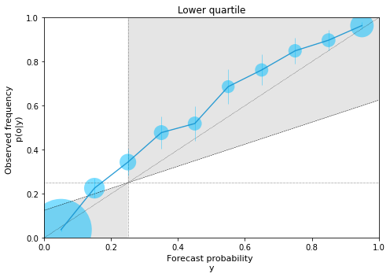
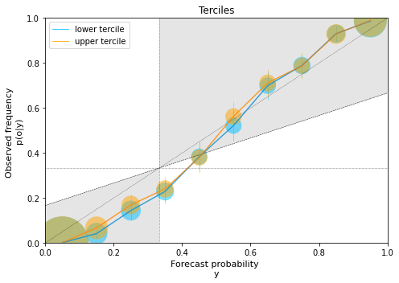

# Documentation  

A package which provides the **contigency table** and all the other ingredients required to plot a reliability diagram. We also provide examples to show how this package could be used to create customized reliability diagrams based on user requirements.

**For documentation, please refer to https://github.com/clecoz/ReliabilityDiagram** 

A reliability diagram is a diagnostic plot to understand the quality of a probabilistic forecast for categorical events. An example of a categorical event can be the probability for the daily average temperature in Paris to be in the lower tercile of the climatological distribution. Obtaining a contingency table is an essential first step in producing a reliability diagram. A contingency table is a matrix indicating the number of times an event forecasted with a certain probability occurs (or not). The probabilities are usually binned. A contingency table is produced by first binning the sample according to forecast probability, and then by computing the frequency of the observed event for all of the forecasts in each bin. A typical contingency table is shown below:

| Forecast probability | Events observed | Events not observed |
| :----:               |    :----:       |        :----:       |
| 0.0 - 0.2            | y1              | x1                  |
| 0.2 - 0.4            | y2              | x2                  |
| 0.4 - 0.6            | y3              | x3                  |
| 0.6 - 0.8            | y4              | x4                  |
| 0.8 - 1.0            | y5              | x5                  |

A reliability diagram plots the observed frequency against the forecast probability for each bin. The points are generally plotted at the midpoints of the bins. A perfectly reliable forecasting system has points lying on the 45° diagonal line, indicating that the forecast probability is essesntially equal to observed frequency on average. Climatological frequency line is drawn horizontally at a location corresponding to the event's probability, for e.g. the climatological frequency of a tercile is 1/3 and that of decile is 1/10. Similarly, the average forecast porbability line is drawn vertically corresponding to the event. The smaller the distance between the points and the diagonal line, the higher is the reliability of the forecasting system. The larger the distance between the points and the horizontal climatological line, the higher is the resolution of the forecasting system. The line that bisects the angle between the perfect reliability line (i.e., the diagonal) and the horizontal climatological line is called the no skill line. On this line, the reliability and the resolution components become equal and so the forecast skill (measured using Brier Skill Score ([5], [2], [3])) becomes equal to that of climatology. Accordingly, the points located within the shaded region contribute positively to skill. For a more detailed description of the reliability diagram, the reader is referred to section 9.4.4 of Chapter 9 in [3] or section 4b in [4] or section 4.3 in [5].  

_References_:

[1] Sanders, F., 1963: On Subjective Probability Forecasting. Journal of Applied Meteorology and Climatology, 2 (2), 191–201, https://doi.org/10.1175/1520-0450(1963)002<0191:OSPF>2.0.CO;2, URL https://journals.ametsoc.org/view/journals/apme/2/2/1520-0450_1963_002_0191_ospf_2_0_co_2.xml, publisher: American Meteorological Society Section: Journal of Applied Meteorology and Climatology.

[2] Jolliffe, I., and D. Stephenson, 2003: Forecast Verification: A Practitioner’s Guide in Atmospheric Science. Wiley, URL https://books.google.cm/books?id=cjS9kK8IWbwC

[3] Wilks, D. S., 2019: Chapter 9 - forecast verification. In Statistical methods in the atmospheric sciences. 4th ed., Elsevier, Cambridge.

[4] Goutham, N., Plougonven, R., Omrani, H., Parey, S., Tankov, P., Tantet, A., Hitchcock, P., & Drobinski, P. (2022). How Skillful Are the European Subseasonal Predictions of Wind Speed and Surface Temperature?, Monthly Weather Review, 150(7), 1621-1637. Retrieved Sep 25, 2022, from https://journals.ametsoc.org/view/journals/mwre/150/7/MWR-D-21-0207.1.xml

[5] Coelho, C. A. S., B. Brown, L. Wilson, M. Mittermaier, and B. Casati, 2019: Forecast verification for S2S timescales. Sub-Seasonal to Seasonal Prediction: The Gap between Weather and Climate Forecasting, A. Robertson, and F. Vitart, Eds., Elsevier, 337–361, Chapter: 16.

[6] Brier, G. W., 1950: Verification of forecasts expressed in terms of probability. 3.

---
## _Installation:_

```sh
pip install ReliabilityDiagram
```
---
## _Parameters:_

**observation**: numpy.ndarray, shape (nsim,)  
Observation/truth for nsim events.

**forecast**: numpy.ndarray, shape (nsim,mem_fc)  
Ensemble forecasts with ensemble size mem_fc for the same nsim events.

**climatology**: numpy.ndarray, shape (nsim,mem_cl)  
Climatology for the same nsim events with mem_cl the number of years considered.  

**event_lbound**: int or float  
The lower bound for the event considered.  
E.g. 1: If the event considered is lower tercile, then event_lbound value is 0.  
E.g. 2: If the event considered is upper tercile, then event_lbound value is 2/3.  
_NOTE_: The value should be in the range of 0 to 1. This value should be lesser than the value of event_ubound.

**event_ubound**: int or float  
The upper bound for the event considered.  
E.g. 1: If the event considered is lower tercile, then event_ubound value is 1/3.  
E.g. 2: If the event considered is upper tercile, then event_ubound value is 1.  
_NOTE_: The value should be in the range of 0 to 1. This value should be greater than the value of event_lbound.
            
**closed_ends**: str, optional  
The bounds (upper and/or lower) to include in the event formulation. Options: 'left', 'right', 'none', 'both'.  
E.g. 1: If closed_ends = 'left', then the event becomes event_lbound <= event < event_ubound.  
E.g. 2: If closed_ends = 'both', then the event becomes event_lbound <= event <= event_ubound.  
_NOTE_: The default value is 'both'. The value is case sensitive.  
_NOTE_: This option is overwritten when event_lbound=0 or event_ubound=1 in order to include the forecast values that are outside the bounds of the climatology.  

**nbins**: int, optional  
Number of bins to stratify the forecasts into. The default is 5.  
_NOTE_: The bins are of equal width. The number of bins should be lesser than the dimension of observation.
            
**weights**: numpy.ndarray, shape (nsim,mem_fc), optional  
The weights of the members of the ensemble forecast. It should have the same shape as the forecast data.

---
## _Method(s):_

**contingency_table()**:  
This method computes the contingency table for the defined event.  
_Returns_: Contingency table having shape (nbins,2) where the first column corresponds to the "yes" event and the second column corresponds to the "no" event.

**observed_frequency()**:  
_Returns_: The observed relative frequency for each bin. This is required for plotting the reliability diagram.  

**confidence_intervals()**:  
_Returns_: This function returns the lower and the upper confidence intervals, respectively, corresponding to the observed frequency. This is required for plotting the reliability diagram.

**forecast_attributes()**:  
This method computes the Brier Score along with the reliability and the resolution attributes.  
_Returns_: Brier Score, Reliability, Resolution.

---
## _Demonstration:_

```python
import ReliabilityDiagram as rd
import numpy as np
import matplotlib.pyplot as pl
```
----
### Example - 1:
* Create case data
###### Input
```python
nobs = 5000   # number of events
nclim = 30    # number of years considered in climatology
nfc = 51      # ensemble size of the forecasts

clima = np.random.normal(loc=0,scale=10,size=(nobs,nclim))   # climatology (follows the same normal distribution for all events)
obs = np.random.normal(loc=0,scale=10,size=(nobs))           # observations drawn from the same distribution as climatology
fcast = np.random.normal(loc=obs+np.random.normal(loc=2,scale=5,size=(nobs)) ,scale=5,size=(nfc,nobs)).T   # forecasts (also generated by a normal distribution 
                                                                                                           # s.t. ensemble mean = observations + bias + noise)
```
* Compute contingency table and forecast attributes
###### Input
```python
data = rd.ReliabilityDiagram(obs,fcast,clima,0,1/4,closed_ends='both',nbins=10)  # example for lower quartile
```

###### Input
```python
c_table = data.contingency_table()    
print(c_table)
```
###### Output

    array([[  69., 2846.],
           [  56.,  288.],
           [  83.,  174.],
           [  76.,  112.],
           [  89.,   85.],
           [  92.,   64.],
           [ 108.,   44.],
           [ 101.,   40.],
           [ 137.,   27.],
           [ 484.,   25.]])

###### Input
```python
bs, rel, res = data.forecast_attributes()
print(bs, rel, res)
```

###### Output

    0.08378799999999999 0.003151037068348895 0.11128203706834891
    
* Plot reliability diagram

###### Input
```python
# Compute needed elements for diagram
yi = data.bins  # both have the same bins for the forecast probabilities
oi = data.observed_frequency
ci_low, ci_upp = data.confidence_intervals()
wti = np.sum(c_table,axis=1)/np.sum(c_table) 

# Elements for plot
xd = yd = [0,1]
q = data.ub - data.lb
clim_x = clim_y = [q,q]
sk_line = [q/2,(1-q)/2+q]

# Plot
# (in this example, the lower quartile is underforecasted)
fig = pl.figure(figsize=(7,5))
pl.plot(xd,yd,color='black',linestyle=':',linewidth=0.5)
pl.plot(xd,clim_y,color='black',linestyle=':',linewidth=0.5)
pl.plot(clim_x,yd,color='black',linestyle=':',linewidth=0.5)
pl.plot(xd,sk_line,color='black',linestyle='--',linewidth=0.5)
pl.fill_between(xd,xd,sk_line,facecolor='grey',alpha=0.2)
pl.fill_betweenx(yd,yd,clim_x,facecolor='grey',alpha=0.2)
pl.scatter(yi,oi,s=wti*10000,color='deepskyblue',marker='o',alpha=0.5,edgecolors='none')
pl.plot(yi,oi,color='deepskyblue',linestyle='-',linewidth=0.8)
pl.errorbar(yi,oi,yerr=[oi - ci_low, ci_upp - oi],ecolor='deepskyblue',elinewidth=0.8,alpha=0.5)
pl.ylim(0.0,1.0)
pl.xlim(0.0,1.0)
pl.ylabel('Observed frequency \np(o|y)',fontsize=11)
pl.xlabel('Forecast probability \ny',fontsize=11)
pl.title("Lower quartile ")
pl.tight_layout()
```

###### Output


    
----

### Example - 2:

###### Input
```python
fcast2 = np.random.normal(loc=obs+np.random.normal(loc=0,scale=3,size=(nobs)) ,scale=5,size=(nfc,nobs)).T   
```

###### Input
```python
data_lt = rd.ReliabilityDiagram(obs,fcast2,clima,0,1/3,closed_ends='both',nbins=10)  # example for the lower tercile
data_ut = rd.ReliabilityDiagram(obs,fcast2,clima,2/3,1,closed_ends='both',nbins=10)  # example for the upper tercile
# ```

* Plot reliability diagram

###### Input
```python
# Compute needed elements for diagram
c_table_lt = data_lt.contingency_table()
wti_lt = np.sum(c_table_lt,axis=1)/np.sum(c_table_lt)
oi_lt = data_lt.observed_frequency()
ci_low_lt, ci_upp_lt = data_lt.confidence_intervals()

c_table_ut = data_ut.contingency_table()
wti_ut = np.sum(c_table_ut,axis=1)/np.sum(c_table_ut)
oi_ut = data_ut.observed_frequency()
ci_low_ut, ci_upp_ut = data_ut.confidence_intervals()

# Other elements for plot
xd = yd = [0,1]
q = 1/3   # tercile
clim_x = clim_y = [q,q]
sk_line = [q/2,(1-q)/2+q]

# Plot
# (in this example, the model is inderconfident)
fig = pl.figure(figsize=(7,5))
pl.plot(xd,yd,color='black',linestyle=':',linewidth=0.5)
pl.plot(xd,clim_y,color='black',linestyle=':',linewidth=0.5)
pl.plot(clim_x,yd,color='black',linestyle=':',linewidth=0.5)
pl.plot(xd,sk_line,color='black',linestyle='--',linewidth=0.5)
pl.fill_between(xd,xd,sk_line,facecolor='grey',alpha=0.2)
pl.fill_betweenx(yd,yd,clim_x,facecolor='grey',alpha=0.2)
pl.scatter(data_lt.bins,oi_lt,s=wti_lt*10000,color='deepskyblue',marker='o',alpha=0.5,edgecolors='none')
pl.plot(data_lt.bins,oi_lt,color='deepskyblue',linestyle='-',linewidth=0.8, label="lower tercile")
pl.errorbar(data_lt.bins,oi_lt,yerr=[oi_lt - ci_low_lt, ci_upp_lt - oi_lt],ecolor='deepskyblue',elinewidth=0.8,alpha=0.5)
pl.scatter(data_ut.bins,oi_ut,s=wti_ut*10000,color='orange',marker='o',alpha=0.5,edgecolors='none')
pl.plot(data_ut.bins,oi_ut,color='orange',linestyle='-',linewidth=0.8, label="upper tercile")
pl.errorbar(data_ut.bins,oi_ut,yerr=[oi_ut - ci_low_ut, ci_upp_ut - oi_ut],ecolor='orange',elinewidth=0.8,alpha=0.5)
pl.ylim(0.0,1.0)
pl.xlim(0.0,1.0)
pl.legend()
pl.ylabel('Observed frequency \np(o|y)',fontsize=11)
pl.xlabel('Forecast probability \ny',fontsize=11)
pl.title("Terciles")
pl.tight_layout()
```

###### Output


